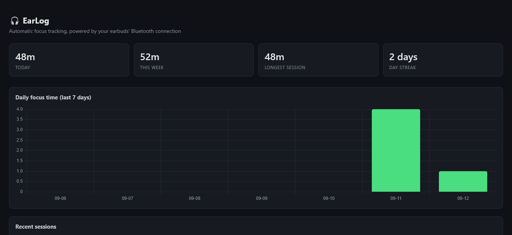
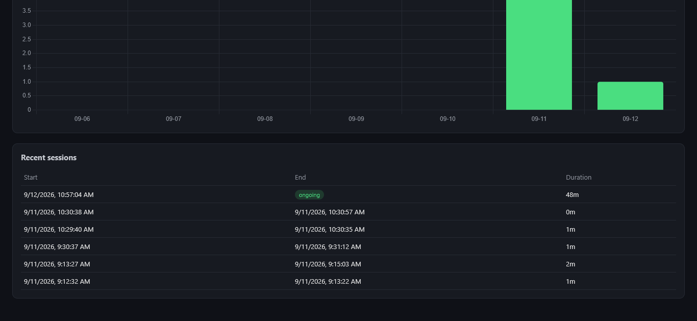

# EarLog 🎧

Automatic focus-time tracking using your earbuds' Bluetooth connection state — no timer, no button. Connect your earbuds to start a session, disconnect to end it.
# Dashboard




## How it works

```
Phone (EarLog app)                    PC (this repo)
 detects earbuds connect/disconnect     runs a local Flask server
 sends event over Wi-Fi        --->     stores it in SQLite
                                         computes sessions + stats
                                         serves a live dashboard
```

Everything runs on your own local network — no cloud, no account, no data leaving your devices.

## Part 1 — Run the server on your PC

**Option A — no Python needed:**
1. Go to [Releases](../../releases) and download `earlog.exe`
2. Double-click it to run

**Option B — from source (requires Python 3.9+):**
```bash
git clone https://github.com/<you>/earlog.git
cd earlog
pip install -r requirements.txt
python api.py        # Windows: double-click run_windows.bat instead
```

Either way, find your PC's local IP address:
- Windows: `ipconfig` → look for "IPv4 Address"
- Mac/Linux: `ifconfig` or `ip addr`

Open `http://localhost:5000` in a browser to confirm the dashboard loads (it'll be empty until you connect the phone app).

> **Note:** this runs Flask's built-in development server, intended for local home-network use only. Don't expose port 5000 to the public internet.

## Part 2 — Install the Android app

1. Go to [Releases](../../releases) and download the latest `earlog.apk`
2. On your phone, tap the downloaded file to install (you'll be prompted to allow "install unknown apps" for your browser/file manager the first time — this is a one-time Android permission, not a permanent setting)
3. Open EarLog, grant Bluetooth and Notification permissions when asked

## Part 3 — Configure and connect

1. Find your earbuds' Bluetooth MAC address:
   - Android: Settings → About phone → look under paired Bluetooth devices, or use a BLE scanner app like nRF Connect
2. In the EarLog app, enter:
   - Your PC's IP address (from Part 1)
   - Your earbuds' MAC address
3. Tap **Start Monitoring**
4. Connect/disconnect your earbuds and watch the dashboard update in real time

## Project structure

```
earlog/
├── db.py                  # SQLite schema + connection helper
├── sessions.py             # turns raw events into sessions + stats
├── api.py                  # Flask server: dashboard + API routes
├── requirements.txt
├── run_windows.bat          # one-click launcher for Windows (source install)
└── dashboard/
    └── index.html             # the dashboard UI (Chart.js)
```

The Android app's source isn't included in this repo — grab the built APK from [Releases](../../releases).

## Limitations & ideas for extending

- Tracks one earbuds device at a time (by MAC address)
- No auth on the API — fine for a trusted home network, not for exposing beyond it
- Ideas: tag sessions with active window/app, CSV export, multi-device support, HTTPS support

## License

MIT
